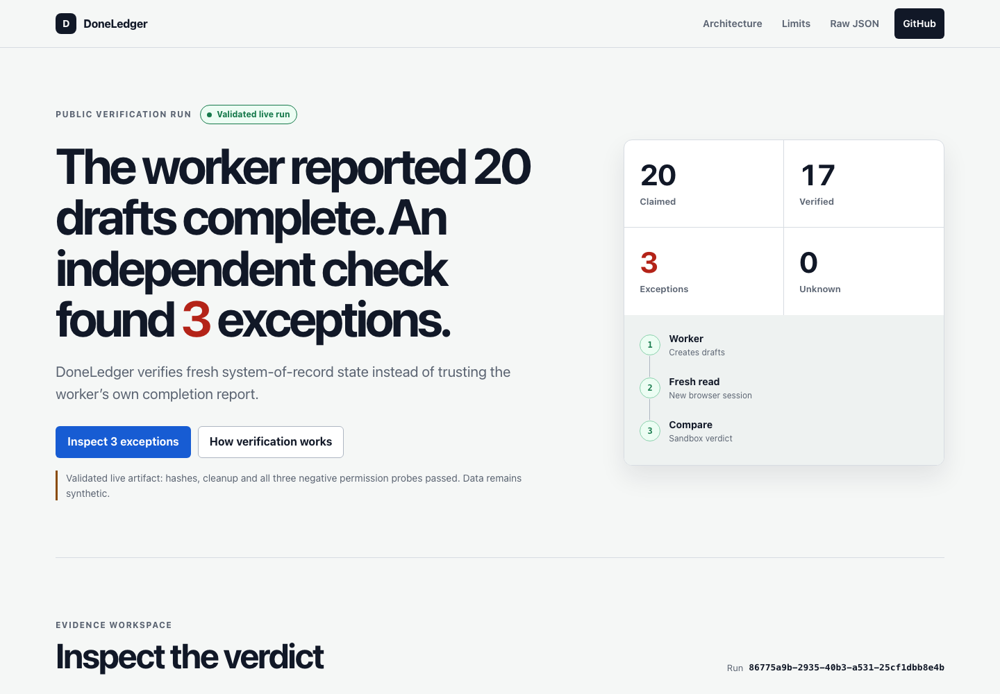

# DoneLedger

> The worker claimed 20 invoices complete. A fresh verifier admitted only 17.

DoneLedger is a small public proof of one idea: automated work should be billed or approved from independently observed state, not from the worker's self-report. The committed artifact is a synthetic live run: a write-limited Solari browser entered draft supplier invoices in Dolibarr, a fresh read-only Solari browser observed them, and a Solari sandbox reproduced the deterministic comparison.

The included data is synthetic. This is a technical demonstration, not a production finance system or a customer result.

## Run the SaaS locally

```bash
cd examples/doneledger
npm ci
npm test
npm start
open http://127.0.0.1:3000/
```

The marketing sample is public. Creating a demo or live run requires an email/password account so history, sharing, revocation and deletion remain isolated between users. Passwords are stored as salted scrypt hashes; expiring sessions use opaque HttpOnly cookies. There is deliberately no password reset, billing, team model or social login in this proof. Live verification is invitation-only and remains disabled unless the server has both `SOLARI_API_KEY` and `DONELEDGER_LIVE_ACCESS_CODE`. A live request uses one fresh Solari browser with the submitted read-only Dolibarr account, confirms invoice-create and payment-create routes are denied, reads the claimed invoice references, releases the browser, compares in one Solari sandbox, and saves only the condensed report. Credentials are not persisted.

The SaaS answers a deliberately narrow question: do the invoice records in a submitted claim match a fresh Dolibarr snapshot? It does not prove who created those records, retain the complete ERP rows, or authorize accounting or payment actions. Input hashes in a report are fingerprints of the compared data, not independently recalculable proofs. Live jobs allow one process-wide run at a time, three attempts per hour per direct client address, no SDK retries, and a six-minute abort signal; reports expire after seven days.

```bash
SOLARI_API_KEY=slr_live_... \
DONELEDGER_LIVE_ACCESS_CODE=choose-a-long-private-code \
DONELEDGER_ALLOWED_DOLIBARR_ORIGINS=https://your-authorized-erp.example \
DONELEDGER_DATA_DIR=/persistent/doneledger \
npm start
```

`DONELEDGER_DATA_DIR` must point to a persistent private volume in deployment. It contains `auth.json` and run reports, written atomically with mode `0600`. The auth API is `POST /api/auth/signup`, `POST /api/auth/login`, `POST /api/auth/logout`, and `GET /api/me`. Signup and login accept `{ "email": "...", "password": "..." }`; passwords must contain 12 to 128 characters. Sessions expire after seven days and logout invalidates the server-side session immediately.



## Run from a clean clone

Node 20 or newer is required for the verifier. The interface itself has no framework or build step:

```bash
cd examples/doneledger
npm ci
npm test
npm start
open http://127.0.0.1:3000/
```

Create an account, then click **Try Sample Run** to create a synthetic 17/20 report through the real HTTP API. The committed `results/run.json` remains the evidence for the earlier seeded proof CLI. If any loaded artifact fails its schema, hash, counter, permission, or cleanup gates, the interface rejects the live claim and visibly falls back to its bundled fixture.

## Legacy seeded-proof gates

The optional `npm run live` CLI demonstrates the original two-browser seeded proof. Do not label that legacy proof live until every gate passes:

1. A real Solari browser session signs into an external Dolibarr instance as the worker.
2. Dolibarr has `MAIN_USE_ADVANCED_PERMS` enabled. Without it, create permission can imply validate permission.
3. The worker can read and create supplier-invoice drafts, but cannot validate, create bank transfers, or record supplier payments.
4. A different Dolibarr user in a fresh Solari browser can read and export, but cannot create, modify, validate, or pay.
5. Negative permission checks are captured: worker validation denied, worker payment denied, verifier mutation denied.
6. The verifier reloads the ERP rather than consuming worker memory, output, cookies, or a worker-generated export.
7. The sandbox comparison terminates successfully and the UI loads its resulting `run.json` without fallback.
8. Both browsers and the sandbox are released or killed on success and failure.

Dolibarr's shared public demo is not a release environment: it is shared, restricted, unstable, and periodically reset. Use a dedicated demo instance or an authorized instance with synthetic data. Review that provider's terms before browser automation.

## Required environment

Keep every value in local environment variables or a secret store; never commit them:

```bash
export DONELEDGER_MODE=live
export SOLARI_API_KEY=slr_live_...
export DONELEDGER_WORKER_URL=https://your-authorized-erp.example/worker-path
export DONELEDGER_VERIFIER_URL=https://your-authorized-erp.example/verifier-path
export DONELEDGER_WORKER_PROFILE_ID=...
export DONELEDGER_VERIFIER_PROFILE_ID=...
export DONELEDGER_WORKER_USERNAME=...
export DONELEDGER_WORKER_PASSWORD=...
export DONELEDGER_VERIFIER_USERNAME=...
export DONELEDGER_VERIFIER_PASSWORD=...
```

Fixture mode is the safe default and requires no credentials: `DONELEDGER_MODE=fixture`. For a live run, copy `.env.example` to the ignored `.env`, prepare the two profiles once with `npm run profiles:save`, remove the username/password entries, run `npm run canary`, then run `npm run live`. Profile IDs are not permission boundaries unless the underlying Dolibarr accounts have the required rights. Administrator credentials are deliberately absent. The automated path must not possess validation or payment authority. Do not expose API keys, passwords, Solari session IDs, control URLs, preview URLs, cookies, or unredacted replays in logs, artifacts, screenshots, commits, issues, or posts.

The committed live artifact was generated on 2026-09-01 against a dedicated DoliOnDemand trial containing only synthetic suppliers and invoices. It records all three negative permission probes and successful cleanup. It is evidence of this run only, not a reliability, accounting, compliance, or customer claim.

The current SaaS endpoint received one separate controlled canary on 2026-09-01: run `929d9367-904e-4315-b2a8-0c24a7e79b9f`. The read-only account passed the negative create and payment probes, the browser and sandbox cleanup gates passed, and no submitted credential or access code appeared in the mode-`0600` report. Its verdict was `RECORD_MISSING` (0/1 verified), so it proves the live fail-closed exception path rather than a positive invoice match. It was not retried.

## Canonical evidence contract

`results/run.json` uses this canonical schema. The renderer accepts a few legacy aliases, but producers should only emit these names:

```json
{
  "runId": "run-2026-09-01-001",
  "mode": "live",
  "synthetic": true,
  "generatedAt": "2026-09-01T14:30:00Z",
  "manifestHash": "sha256-of-ground-truth-fixture",
  "exportHash": "sha256-of-observed-records",
  "summary": { "claimed": 20, "verified": 17, "exceptions": 3, "unknown": 0 },
  "items": [
    {
      "jobId": "DL-001",
      "status": "verified",
      "reasonCode": "EXACT_MATCH",
      "expectedTotal": 100,
      "observedTotal": 100,
      "recordIds": ["bill_001"],
      "differences": []
    }
  ],
  "permissionEvidence": {
    "workerCannotValidate": true,
    "workerCannotPay": true,
    "verifierCannotMutate": true
  },
  "lifecycle": { "browsersReleased": true, "sandboxKilled": true },
  "disclaimer": "Synthetic fixture; not production finance evidence."
}
```

`mode` is `fixture` or `live`; `synthetic` remains `true` for the public demonstration even when Solari and Dolibarr ran live. `expectedTotal`, `observedTotal`, `recordIds`, and `lifecycle` are optional when unavailable, but absence must never manufacture a successful decision. Allowed statuses are `verified`, `exception`, and `unknown`. Unknown is never silently converted to verified. Reason codes should be stable machine-readable values such as `EXACT_MATCH`, `DUPLICATE_RECORD`, `TAX_MISMATCH`, `FIELD_MISMATCH`, `NOT_DRAFT`, `RECORD_MISSING`, `READ_TIMEOUT`, and `ERP_UNAVAILABLE`.

## Cost guardrails

The SaaS path allocates at most one ordinary browser session and one `base` sandbox, sequentially. The browser SDK uses a 15-second RPC timeout, page operations use 8-10 second timeouts, sandbox RPCs use 30 seconds, the sandbox has a five-minute ceiling, and a six-minute abort signal is checked between records and phases. The legacy seeded CLI may allocate two browsers sequentially and one sandbox. No stealth, proxy, captcha, desktop, volume, snapshot, or recording is requested. Development and fixture validation stay local. Check the Solari balance before each live run and stop on insufficient credit or capacity instead of retrying blindly.

## Claims this project must not make

- A synthetic fixture is not a customer, market, accounting, or compliance validation.
- A rendered page is not proof that a Solari run occurred.
- Two browser sessions are not independent if they share credentials, cookies, worker output, or authority.
- A demo role is not write-limited until the negative permission checks pass.
- A verified draft is not approved, posted, payable, paid, or safe to pay.
- A recorded successful run does not prove future reliability or production readiness.
- Solari is the demonstrated execution provider, not the only provider capable of this architecture.

## Cleanup

Every run must close both browser clients and kill its sandbox in `finally` paths. Remove synthetic supplier invoices and demo users when the external instance is no longer needed. Delete stale profiles, replays, volumes, and run artifacts according to the documented retention policy. Rotate any credential that appears in output.

## Public challenge checklist

Before sharing the application:

- fork the Solari Cookbook into a public GitHub repository;
- keep install and reproduction steps runnable from a clean clone;
- execute and preserve evidence from the real Solari path;
- document AI assistance in [`AI_BUILD_LOG.md`](AI_BUILD_LOG.md);
- publish the build on X or LinkedIn;
- tag `@harrychow_` and `@getsolari`;
- link the public repository and an honest end-to-end demonstration;
- label fixtures, failed gates, limitations, and any unverified claim plainly.

There is no claim here that completing this checklist guarantees an interview or hiring outcome.
